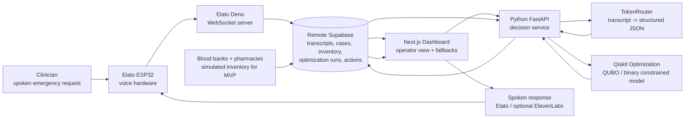

# MatriBlood Q

Voice-first quantum-optimized procurement for obstetric emergency kits.

MatriBlood Q is a hackathon MVP concept for maternity emergencies such as postpartum hemorrhage. A clinician speaks the requested blood products and emergency medicines into an Elato ESP32 voice device. The system turns that request into structured procurement requirements, uses Qiskit to optimize the source-product-courier plan, and returns a clear action plan through a dashboard and spoken response.

## Demo Assets

- [Final presentation PDF](deliverables/MatriBlood-Q-Final-Presentation.pdf)
- [Demo video](https://drive.google.com/file/d/1WVqVO4nMaRWEmLcVUr1ft7HtkUqciEzf/view?usp=sharing)

## Problem

Maternity emergencies often need a complete kit quickly, not just partial stock visibility. A nearby blood bank may have one product but not another, platelets may expire soon, and medicines may need to come from a pharmacy rather than a blood bank. The hard decision is choosing the fastest feasible combination across sources, inventory, compatibility, expiry, and courier constraints.

## Proposed Approach

1. Clinician speaks an emergency request into the Elato device.
2. Elato voice infrastructure writes the transcript into Supabase.
3. TokenRouter parses the transcript into structured JSON.
4. Python/FastAPI sends the case and inventory state to the Qiskit optimizer.
5. Qiskit selects the best procurement plan across blood banks, pharmacies, and couriers.
6. Supabase stores the optimization run and procurement actions.
7. The Next.js dashboard and voice response present the action plan.

## Architecture

## Quantum Component

The quantum component is the procurement decision engine, not a decorative add-on.

MatriBlood Q models procurement as a constrained binary optimization problem:

- `take_PRBC_from_bank_A = 0/1`
- `take_platelet_from_bank_B = 0/1`
- `take_oxytocin_from_pharmacy_D = 0/1`
- `send_courier_2_to_bank_B = 0/1`

The objective minimizes:

- complete-kit arrival time
- missing critical items
- incompatible or impossible allocations
- courier overload
- avoidable expiry waste

The constraints include:

- available stock
- simplified blood compatibility rules
- expiry windows
- courier capacity
- emergency target time

Safe claim: MatriBlood Q formulates the problem as a QUBO/Ising-style constrained optimization model and solves it with a Qiskit hybrid quantum-classical workflow. It does not claim quantum speedup.

## Tech Stack

- Elato ESP32 hardware for voice input/output
- PlatformIO for firmware setup
- Elato Deno WebSocket server for voice transport
- Remote Supabase for shared state
- TokenRouter for transcript parsing
- Python FastAPI for backend APIs
- Qiskit Optimization for procurement planning
- Next.js + TypeScript for the dashboard
- ElevenLabs optional for polished TTS

## MVP Demo Scenario

Voice request:

> Postpartum hemorrhage emergency. Patient unstable. Need 2 O-negative PRBC, 2 FFP, 1 platelet, TXA, and oxytocin within 30 minutes.

Greedy baseline:

- nearest blood bank is fast but incomplete
- missing platelet and medicine

Qiskit optimized plan:

- Blood Bank A: 1 PRBC + 2 FFP
- Blood Bank B: 1 PRBC + 1 platelet
- Pharmacy D: oxytocin
- complete kit ETA: around 24 minutes
- missing critical items: 0

## Safety Boundary

MatriBlood Q is a procurement and logistics support tool. It does not diagnose, prescribe, or decide treatment. Clinical compatibility and use of blood products or medicines must be verified by qualified clinicians and transfusion specialists.
